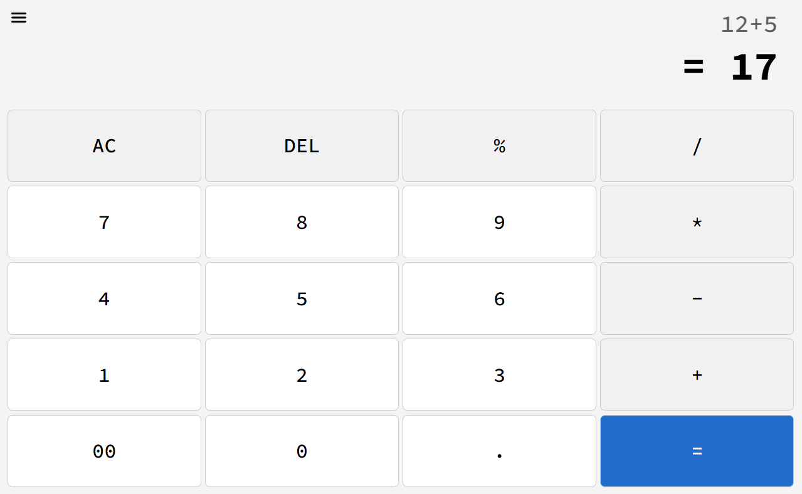
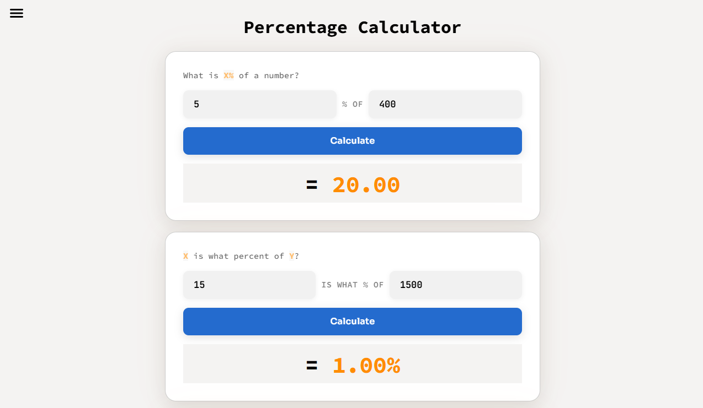
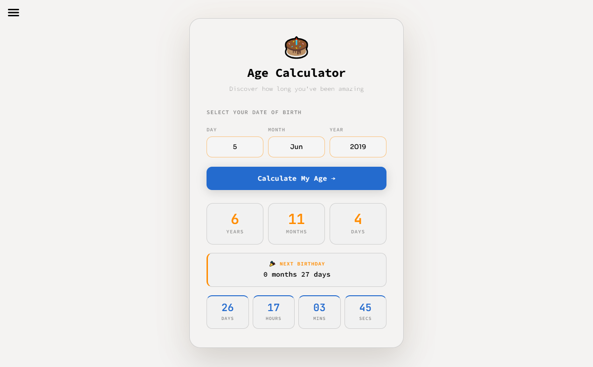
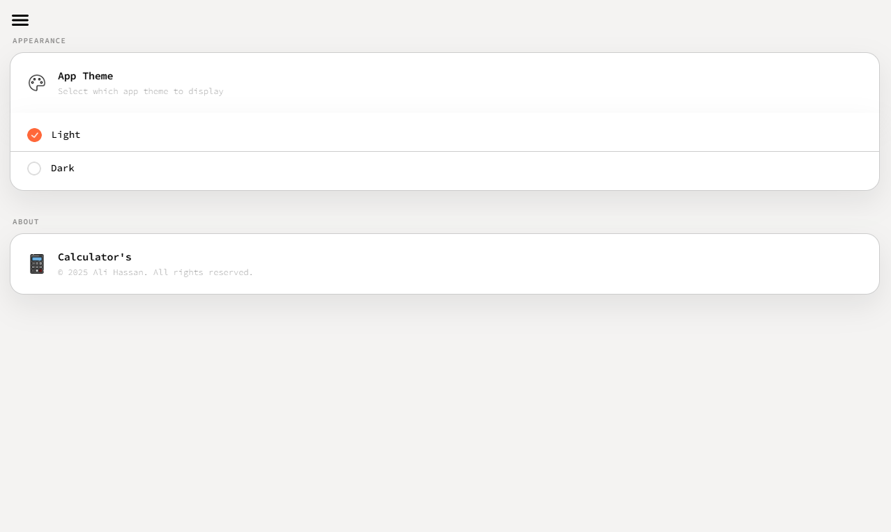
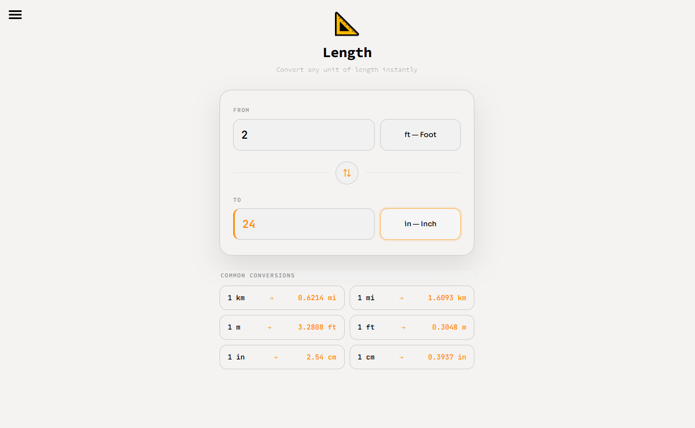

# 🧮 Calckit

> A modern, full-stack calculator suite built with React.js and Django REST Framework.

[](https://calckit.netlify.app)
[](https://reactjs.org)
[](https://www.django-rest-framework.org)
[](https://www.postgresql.org)

---

## 📸 Screenshots


| Standard Calculator | Percentage Calculator |
|---|---|
|  |  |

| Age Calculator | Settings / Theme |
|---|---|
|  |  |

| Length Calculator  |
|---|---|
|  |

---

## 🚀 Live Demo

🔗 **[https://calckit.netlify.app](https://calckit.netlify.app)**

---

## ✨ Features

- **Standard Calculator** — Live expression evaluation with real-time result preview as you type
- **Percentage Calculator** — Three modes: X% of Y, X is what % of Y, and percentage increase/decrease
- **Age Calculator** — Calculates exact age with a live countdown timer to next birthday via REST API
- **Unit Converters** — Length, Weight & Mass, and Time conversions
- **Theme Support** — Light and dark mode with persistent user preference
- **Fully Responsive** — Optimized for all screen sizes from 320px phones to 4K displays
- **Sidebar Navigation** — Smooth animated sidebar with outside-click detection

---

## 🛠️ Tech Stack

### Frontend
| Technology | Purpose |
|---|---|
| React.js 18 | UI framework with hooks |
| React Router DOM | Client-side routing |
| Math.js | Safe expression evaluation (replaces `eval`) |
| React Icons | Icon library |
| CSS Custom Properties | Theming (light/dark mode) |

### Backend
| Technology | Purpose |
|---|---|
| Django REST Framework | RESTful API |
| PostgreSQL | Database |
| Railway | Backend hosting |
| Netlify | Frontend hosting |

---

## 📁 Project Structure

```
calckit/
├── public/
├── src/
│   ├── components/
│   │   └── header.jsx        # Sidebar navigation
│   ├── page/
│   │   ├── standard.jsx      # Standard calculator
│   │   ├── percentage.jsx    # Percentage calculator
│   │   ├── age.jsx           # Age calculator
│   │   ├── length.jsx        # Length converter
│   │   ├── weight.jsx        # Weight converter
│   │   ├── time.jsx          # Time converter
│   │   ├── setting.jsx       # Theme settings
│   │   ├── loading.jsx       # Suspense fallback
│   │   └── errorPage.jsx     # 404 / error page
│   ├── theme/
│   │   └── ThemeContext.jsx  # Global theme context
│   ├── App.jsx
│   └── main.jsx
```

---

## ⚙️ Getting Started

### Prerequisites
- Node.js 18+
- npm or yarn

### Installation

```bash
# 1. Clone the repository
git clone https://github.com/yourusername/calckit.git

# 2. Navigate to the project
cd calckit

# 3. Install dependencies
npm install

# 4. Start the development server
npm run dev
```

App runs at `http://localhost:5173`

---

## 🔌 API Reference

The Age Calculator uses a Django REST API hosted on Railway.

### Calculate Age

```
POST https://portfolio-production-2376.up.railway.app/age/
```

**Request Body:**
```json
{
  "birth_date": "1999-05-15"
}
```

**Response:**
```json
{
  "years": 25,
  "months": 11,
  "days": 24,
  "next_birthday_in": "21 days",
  "next_birthday_countdown": {
    "days": 21,
    "hours": 4,
    "minutes": 32,
    "seconds": 10
  }
}
```

---

## 🎨 Theming

Calckit uses CSS custom properties for full theme support. All colors are controlled via CSS variables:

```css
--input-color         /* text color */
--header-bg-color     /* header and sidebar background */
--num-bg-color        /* number button background */
--sign-bg-color       /* operator button background */
--equal-bg-color      /* equals button background */
--equal-color         /* equals button text */
--btns-border         /* button border */
--sidebar-hover-color /* sidebar item hover */
```

---

## 📱 Responsive Design

| Device | Breakpoint | Behavior |
|---|---|---|
| Small phones | < 360px | Compact font and padding |
| Mobile | 360px+ | Full width, stacked layout |
| Tablet | 768px+ | Centered with max-width |
| Laptop / Desktop | 1024px+ | Full width calculator |
| Landscape phones | height < 500px | Reduced gaps and padding |

---

## 🚀 Deployment

### Frontend — Netlify
```bash
npm run build
# drag and drop /dist folder to Netlify
# or connect GitHub repo for auto-deploy
```

### Backend — Railway
```bash
git push origin main
# Railway auto-deploys on push
```

---

## 🤝 Contributing

Contributions are welcome!

1. Fork the repository
2. Create your feature branch `git checkout -b feature/AmazingFeature`
3. Commit your changes `git commit -m 'Add AmazingFeature'`
4. Push to the branch `git push origin feature/AmazingFeature`
5. Open a Pull Request

---

## 👨‍💻 Author

**Ali Hassan**
- GitHub: [@rkhassan420](https://github.com/rkhassan420)
- LinkedIn: [linkedin.com/in/ali-hassan-dev01](https://www.linkedin.com/in/ali-hassan-dev01/)
- Live Project: [calckit.netlify.app](https://calckit.netlify.app)


---

<p align="center">Made with ❤️ by Ali Hassan</p>
